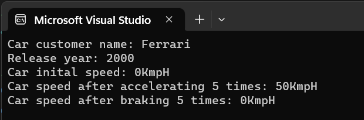

# Competency-Development
for C++ skill development

Assignment 1:
Create a class Car with customerName, speed and release year member variables, 
Also have getter functions, accelerate() and brake() function

Here is the output screenshot

