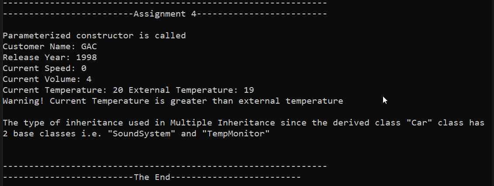

# Competency-Development
for C++ skill development

To build project using VS 2019, create a build folder and run the below cmake command inside build folder using cmd or git bash. 
<b>cmake .. -T v142  -G "Visual Studio 16" -A x64</b>

Assignment 1:
Create a class Car with customerName, speed and release year member variables, 
Also have getter functions, accelerate() and brake() function

Assignment 2:
Implement default, parameterized constructors and destructors with appropriate messages.

Here is the output screenshot 
 

Assignment 3:
Implement an overloaded function.

Here is the output screenshot 
 

Assignment 4:
Use Inheritance

Here is the output screenshot 
 

Refer inc folder for header files and src folder for source files.
